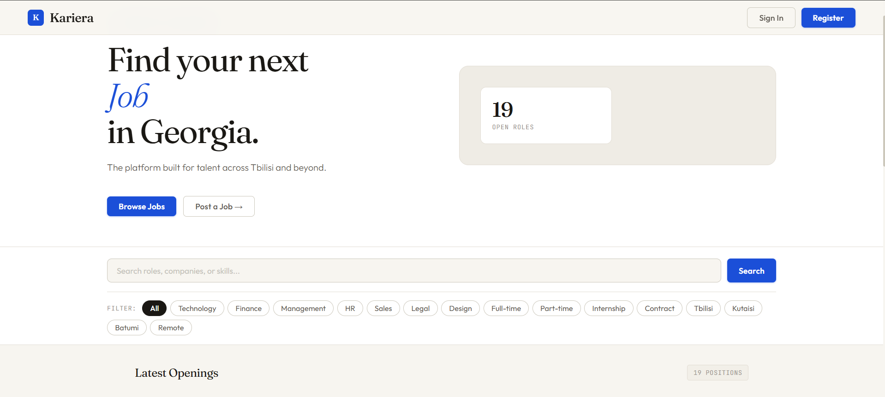
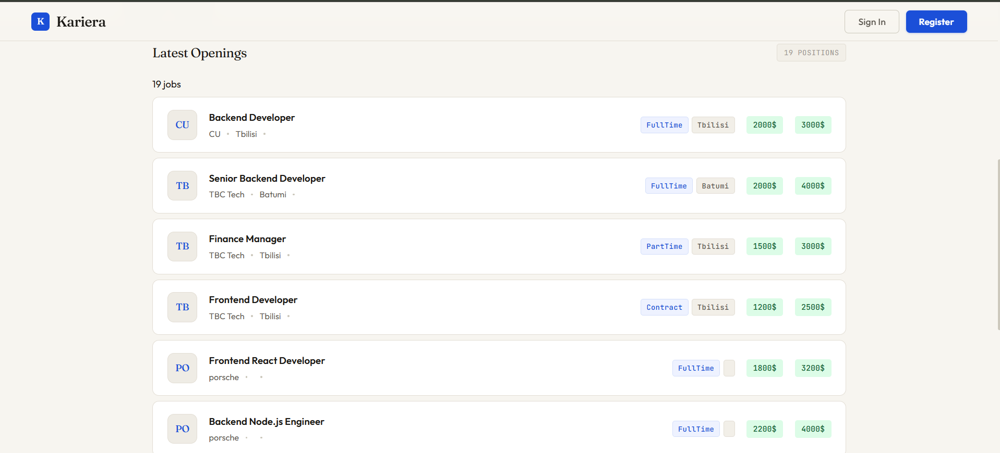
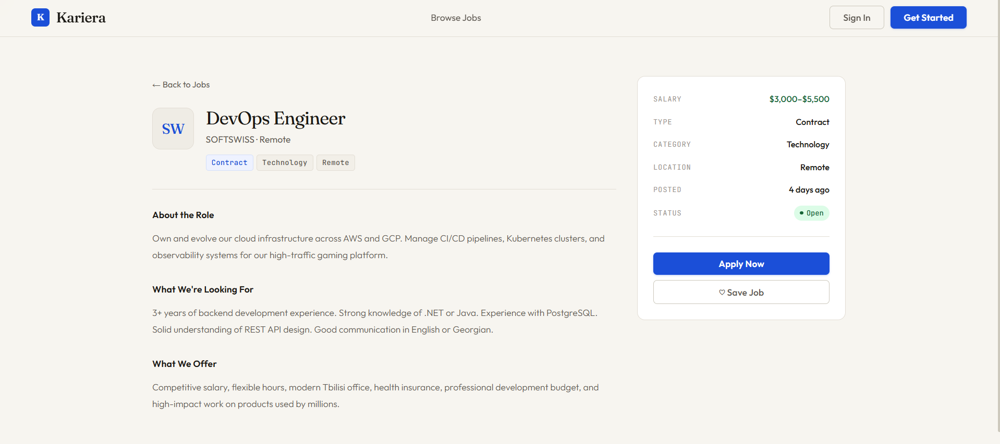
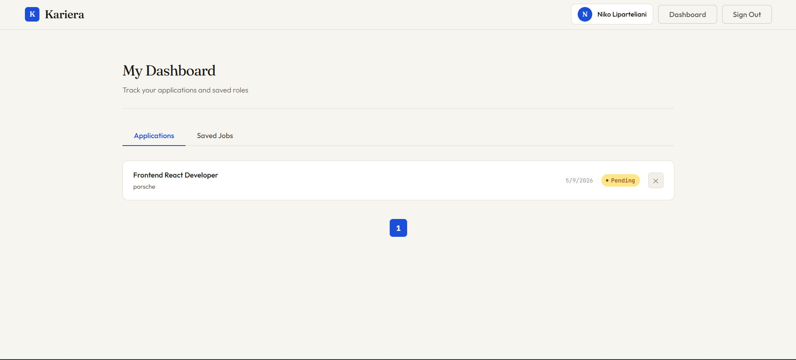
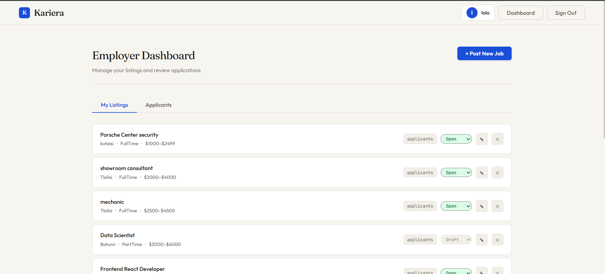

# Kariera — Job Board

A full-stack job board platform connecting job seekers and employers.

**Live Demo:** [https://job-board-dun-ten.vercel.app/]

---

## Tech Stack

**Backend:** ASP.NET Core, C#, Entity Framework Core, PostgreSQL, JWT Authentication, BCrypt, deployed on Railway.app

**Frontend:** React, Axios, React Router, deployed on Vercel

---

## Features

**Authentication**
- JWT-based auth with role separation (Seeker / Employer)
- Secure password hashing with BCrypt
- Session persistence via localStorage
- Protected routes and role-based API authorization

**Jobs**
- Browse, search, and filter listings by category, city, and employment type
- Pagination on all list endpoints
- Employers can create, edit, delete, and manage listing status

**Applications**
- Seekers apply with cover letters and track status (Pending → Reviewed → Shortlisted → Accepted / Rejected)
- Employers view applicants per listing and update application status
- Seekers can withdraw applications

**Saved Jobs**
- Bookmark jobs and manage saved listings

---

## Screenshots







---


## Database Design

- User → SeekerProfile / EmployerProfile (one-to-one by role)
- EmployerProfile → Jobs (one-to-many)
- SeekerProfile → Applications (one-to-many)
- Job → Applications (one-to-many)
- SeekerProfile → SavedJobs (many-to-many via SavedJobs table)

---

## Architecture

REST API with role-based access control. Relational database centered around four core entities — Users, Jobs, Applications, SavedJobs. Separate seeker and employer profiles linked to a shared user model. Frontend communicates via Axios with JWT attached to every authenticated request.

---

## Running Locally

**1. Clone the repository**
```bash
git clone https://github.com/yourusername/JobBoard.git
cd JobBoard
```

**2. Backend setup**
```bash
cd JobBoard
```

Update `appsettings.json` with your PostgreSQL connection string:
```json
"ConnectionStrings": {
  "DefaultConnection": "Host=localhost;Database=jobboard;Username=youruser;Password=yourpassword"
}
```

Apply migrations and run:
```bash
dotnet ef database update
dotnet run
```

**3. Frontend setup**
```bash
cd client
npm install
npm start
```

Frontend runs on `http://localhost:3000`, backend on `http://localhost:5220`.
